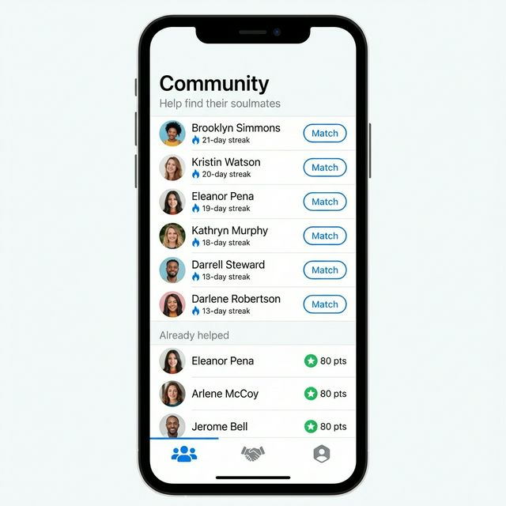

# Bridge Community Screen

A pixel-perfect React Native (Expo) implementation of the **Bridge Community** screen — designed to help users find soulmates by matching and connecting people within their community.

<p align="center">
  
</p>

---

## ✨ Features

- **Community list** — Browse users available to match, with profile photos, names, and streak counts
- **Already Helped section** — View users you've previously helped, with point badges (80 pts)
- **Streak indicators** — Blue flame icon showing each user's active streak (days)
- **Match / Points buttons** — Actionable buttons to trigger matches or view earned points
- **Bottom Navigation Bar** — Community, Handshake, and Profile tabs with active state indicator

---

## 🛠 Tech Stack

| Technology | Purpose |
|---|---|
| React Native (Expo) | Cross-platform mobile framework |
| TypeScript | Type-safe component interfaces |
| NativeWind (TailwindCSS) | Utility-first styling |
| react-native-svg | Custom SVG icon components |
| Expo Web | Web preview via `npm run web` |

---

## 📁 Project Structure

```
src/
├── screens/
│   └── CommunityScreen.tsx       # Main screen assembly
├── components/
│   ├── Community/
│   │   ├── UserRow.tsx           # Reusable user list row
│   │   └── BottomTabBar.tsx      # Navigation bar
│   └── Icons/
│       └── Icons.tsx             # Custom SVG icons (fire, star, tabs)
└── data/
    └── mockCommunityData.ts      # Typed mock data → swap for real API
```

---

## 🔌 Backend Integration

All data is sourced from `src/data/mockCommunityData.ts` using typed interfaces:

```typescript
interface CommunityUser {
  id: string;          // backend user ID
  name: string;        // display name
  streak: number;      // active streak (days)
  imageUrl: string;    // profile photo URL (CDN-ready)
  actionType: 'match' | 'points';
  points?: number;     // for "Already helped" section
}
```

**To connect a real backend**, just replace the two static arrays in `CommunityScreen.tsx`:

```tsx
// Replace:
import { usersToMatch, alreadyHelped } from '../data/mockCommunityData';

// With your own data hook:
const { usersToMatch, alreadyHelped } = useCommunityData();
```

| Feature | API Endpoint |
|---|---|
| Users to match | `GET /community/to-match` |
| Already helped | `GET /community/helped` |
| Trigger a match | `POST /matches` |
| User stats | `GET /community/stats` |

> No component changes required — just return data in the same `CommunityUser[]` shape.

---

## 🚀 Getting Started

```bash
npm install --legacy-peer-deps
npm run web       # Run in browser
npm run ios       # Run on iOS simulator
npm run android   # Run on Android emulator
```

---

## 👥 Team

Built by the Bridge frontend team as part of the Bridge dating app platform.
